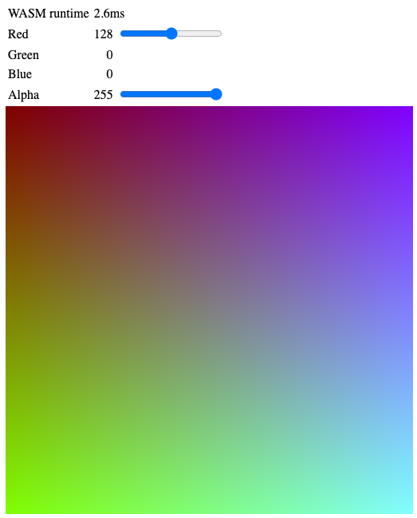

# WebAssembly `colour_square` Generator

A small WebAssembly Text program that generates the RGBA data needed to display a simple colour square 255 pixels square.

The blue value varies down the vertical axis, and the green value varies along the horizontal access.

## Features

The value of the red component is adjusted by moving the red slider.

The overall transparency of the entire colour square can be adjusted by moving the alpha slider.

As you move the mouse pointer over the colour square, the green and blue values are displayed.



## Motivation

This little app was written as an exercise in writing directly in WebAssembly Text.  The specific features that I learned here were:

* Nested loops &mdash; each `(loop)` statement must be contained within its own `(block)`
* Conversion of integer `i32` values into floating point `f32` values and back again.  This functionality is contained within function [$colour-component](https://github.com/ChrisWhealy/colour_map/blob/master/wasm_lib/colour_map.wat#L14)
* Reading WASM linear memory directly from JavaScript

## Prequisites (Required)

You need to have a local Web Server available on your machine.  One of the easiest to use comes with Python3.

```bash
$ python3 -m http.server
```


## Prequisites (Optional)

The WebAssembly Text file [`colour_map.wat`](./wasm_lib/colour_map.wat) has already been compiled into a WASM module.  However, should you wish to perform this step yourself, you must install the correct software to perform WAT -> WASM compilation.

Different tools are available for this, but two of the simplest options are either:

1. The `wat2wasm` command line tool found in the [WebAssembly Binary Toolkit](https://github.com/WebAssembly/wabt) (or `wabt`)

    `wabt` can either be installed by building it directly from the Git repository listed above, or if you already have the [WebAssembly Package Manager](https://wapm.io/package/wabt) installed, you can install it using the command `wapm install wabt`.

1. In Microsoft's Visual Studio Code editor, open the `.wat` file, right-click anywhere in the source code and select "Save as WebAssembly binary file"

## Setup Instructions

1. Clone this repo into some local development directory

    ```bash
    $ cd <some_development_directory>
    $ git clone https://github.com/ChrisWhealy/colour_map.git
    ```

1. Compile WAT source code (Optional)

    Change into the `wasm_lib` directory and run the command to compile the WebAssembly Text file

    ```bash
    $ cd wasm_lib
    $ wat2wasm colour_map.wat
    ```

    This will create the file `colour_map.wasm`

1. Change back to the main repo folder and start your Web Server using the local directory as the document root

    ```bash
    $ python3 -m http.server
    Serving HTTP on 0.0.0.0 port 8000 (http://0.0.0.0:8000/) ...
    ```

1. In your browser, visit [http://0.0.0.0:8000](http://0.0.0.0:8000) and the screen will display the colour square shown above.

    Move the slider left and right, and the colour square is immediately recalculated using that particular value for the red component of each pixel.

## Coding

The WebAssembly Text [source code](./wasm_lib/colour_map.wat) contains lots of explanatory comments and (shock, horror!) meaningful variable names...

Hopefully, this will make understanding the WebAssembly program flow almost entirely self-explanatory.

